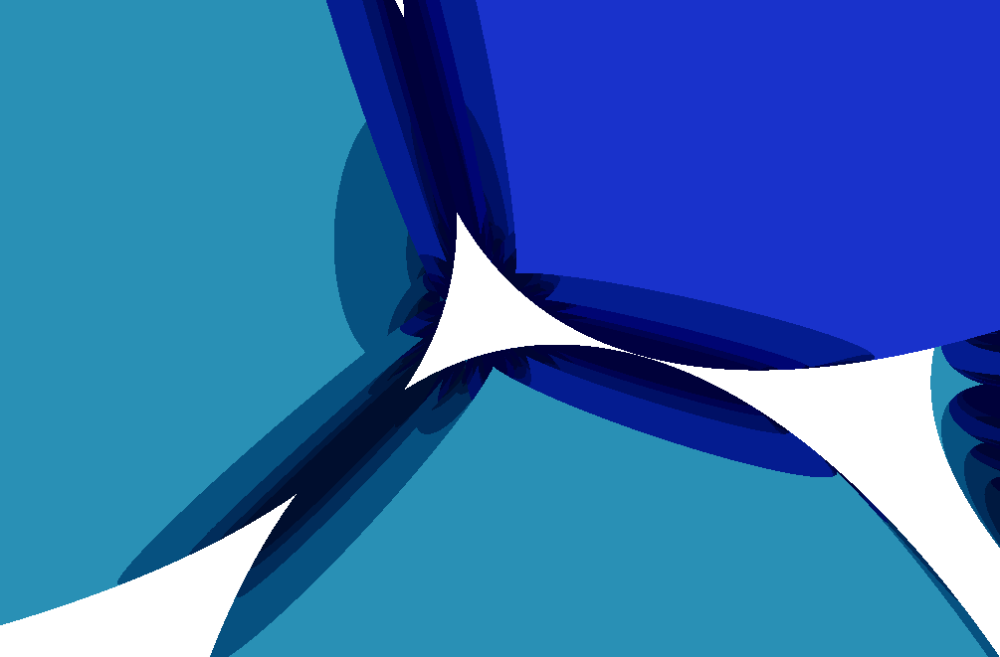
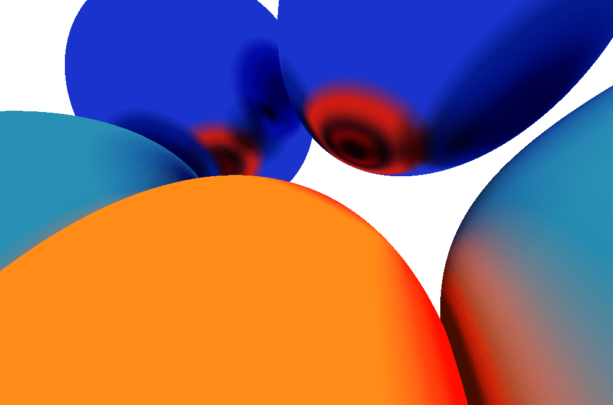
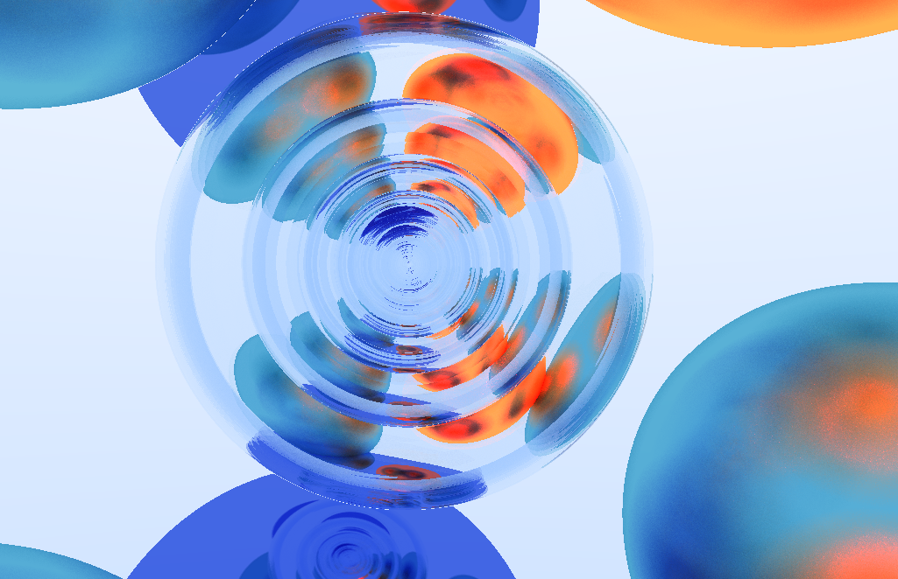

# Dear Future Me,

This is your past self, and this is your ray tracing sandbox. Hopefully you remember buying _Physically Based Rendering_, which inspired me to try ray tracing for myself (and also, the book turned out to be available online for __free__). Hopefully what I'm documenting here is trivial to you now, but in case you need it, I'll do my best to make it not too confusing.

## Ray Tracing / Ray Casting

I've started off with some basic ray tracing, where a couple of rays (by the millions) are sent out in the scene, and bounce around for a while until you get an image. I started off using spheres, as they are quite pretty, don't require transformation matrices, and are surprisingly simple to compute. 

> Mirrors and shadows are so much easier to implement using this method than they are using rasterization!

I was pretty happy for a while, even poked at simple Material features, such as absorbing vs emitting surfaces, rough vs shiny, etc. After a little while, and a bit more reading, I wandered into monte carlo/path tracing, and more complex shapes, implementing planes, and eventually meshes. 

However, my performances being absolutely terrible, I parallelized the whole rendering process using built-in, standard c++ functions. 

I also implemented axis-aligned bounding boxes to reduce the number of raw checks that need to occur for every ray sent out in the scene. While it did not reach near-zero rendering time, it did reduce my rendering time, especially of complex objects, such as meshes.

Unfortunately, even through I did cut my rendering time by quite a bit, it was still hard to do much of anything at all, so I decided to throw money at the problem hoping it would figure itself out. I bought a graphics card (had been working on a 4-core CPU until then).

It is then that I faced a couple of issues. 

1. I had very limited experience with heterologous system design, and much less with CUDA.
2. I had very limited experience with cmake (or other solution-building tool), and I had to transition from premake5 to it.

Even though I would have been very happy to keep using premake5, I quickly realized that if I was going to be doing what I wanted to do, I would have to figure out a lot of things for premake that had already been figured out for cmake. And so I thought: "How hard can it be to transition from one solution-building tool (that I have very limited experience with) to another (which I have no experience with)". Don't let yourself be fooled... it wasn't easy (spoiler alert, I did it)!

It took me roughly a week of tears, sweat and swears to finally transition my existing project from premake5 to cmake. I also threw in the CUDA runtime for bonus points.

> What do cmake and regex have in common? They're both relatively simple to design upfront, but grow in complexity exponentially, and are horrible to debug.

I started off trying to implement various simple highly parallellizable algorithms to get a better grasp of CUDA, and realized that most of what I've done here is not easily parallellizable, so I'm just going to ignore that, move onto a new and shiny project (where I try something new I found while researching this project), and hopefully remember to come back here in the future.

## Ray Marching

I've found this alternative rendering method which doesn't use triangles or any surfaces at all to represent objects. Isn't that something? You can also create very interesting things that cannot be achieved easily with ray tracing, or rasterization methods, such as visualizing non-uniform mediums, or to blend and to intersecting world elements natively.

For now, I've decided to create a bloom effect based on close a ray is to an object. The closer it is to an object, the brighter it shines.

---

###  Reflections

I've now implemented ray bouncing (perfect, metal-like surfaces). Much like I did it in ray-casting, all that was needed was a loop for as long as I had intersected with something inside of the collision interval, or hadn't yet bounced an arbitrary amount of times.

---

### Anti aliasing or path tracing?

I then included anti aliasing. What an absolute waste of time that was. It's only when I was done implementing the whole thing that I realized that I could get the same result using path tracing (which is already implemented) and some variation in the direction of the initial casted ray every frame.

Roughness is also making a come-back. it's been implemented in a pretty simple way, where I add a random value within a unit sphere to the normal of the surface the previous ray intersected with. The rougher the surface, the more scattered it is.

---

### Glass & other dielectrics

I have now been working on including glass (or any other dielectric material). As many people said it online, reflections can be hard! You really gotta make sure everything works one step at a time. I still don't think what I have right now is accurate: the image seen through the dielectric balls are not inverted. I guess I'll have to investigate further.

> Remark: Up to this point, I've never had to deal with transparency, so some bugs with my current ray marcher may have slipped through causing the issues I'm noticing.

---
